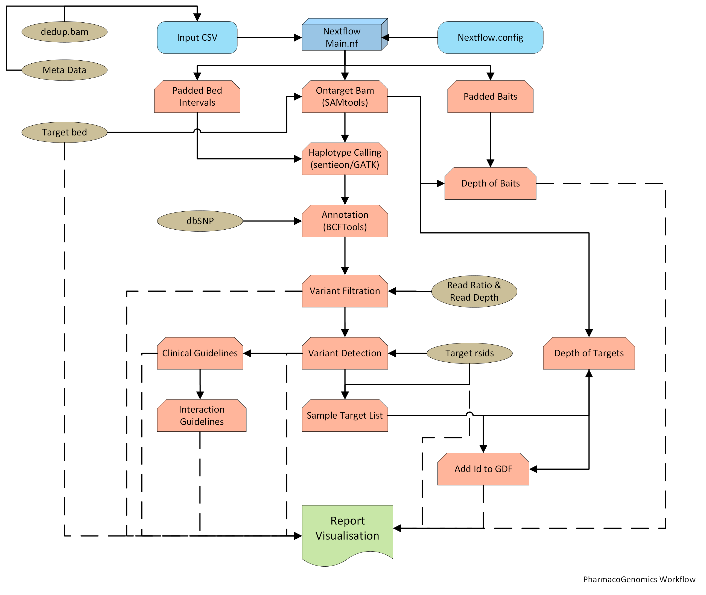

<hr>

[](https://www.nextflow.io/docs/latest/dsl2.html) [](https://sylabs.io/docs/) [](https://sylabs.io/docs/)

[](https://www.pharmgkb.org/) [](https://cpicpgx.org/) [](https://www.pharmvar.org/)

<hr>

<!-- HTML-style heading -->
<h1 style="font-size: 72px;">PGxModule</h1>

## Introduction

Welcome to PGxModule: Revolutionizing Genomic Medicine!

PGxModule is an advanced Nextflow DSL2 workflow, designed to seamlessly integrate into your genomics pipeline. It empowers you to generate sample-specific reports with clinical guidelines, leveraging state-of-the-art variant detection in Genomic Medicine Sweden sequencing panels. This workflow is inspired by JoelAAs.

### Key Features:

- **BAM-Centric Analysis:** PGxModule is tailored to start directly from BAM files, streamlining the analysis process.
- **Flexibility:** Easily integrate into existing pipelines with analysis-ready BAM.
- **Containerization:** Supports Singularity for reproducible and efficient deployment.
- **Customization:** Tailor analyses with profiles such as HG38, HG19, Panel, WGS, and SOLID.

## Pipeline Summary

The pipeline focuses on 19 SNPs from TPMT, DPYD, and NUDT15 genes, with plans to incorporate additional genes in future updates. The target selection is meticulously curated from reputable databases such as [PharmGKB](https://www.pharmgkb.org/) and [PharmVar](https://www.pharmvar.org/), guided by [CPIC](https://cpicpgx.org/) recommendations. As the pipeline evolves, it aims to broaden its scope, providing a more comprehensive analysis of pharmacogenomic variations to enhance clinical insights.  


## Pipeline Steps

The PGxModule pipeline was executed with Nextflow version 23.04.2. The pipeline starts with the provided CSV file (`configs/example.input.csv`) containing sample information, initiating a comprehensive analysis tailored for pharmacogenomic studies.

1. **CSV Validation**  
The CSV Validation step ensures the correctness and integrity of the input CSV file. It checks for proper formatting, required fields, and data consistency, providing a foundation for accurate downstream processing in the PGxModule pipeline.
2. **Getting Ontarget Bam**  
This step involves extracting the on-target BAM files from the analyzed samples. These BAM files specifically capture the sequencing data aligned to the regions of interest, enabling reduction in time and focused analysis on the genomic regions relevant to the pharmacogenomic study.
3. **Haplotype Calling**  
Haplotype Calling is a crucial stage where the pipeline identifies and assembles haplotypes from the sequencing data. This process is fundamental in characterizing the genetic variations present in the samples, laying the groundwork for subsequent analyses and variant interpretation.
4. **Haplotype Annotation**  
Haplotypes which are called are annotated with dbSNP ids. 
5. **Haplotype Filtration**  
Haplotype Filtration focuses on refining the set of identified haplotypes, applying specific criteria to select variants of interest and discard noise. This process enhances the precision of the haplotype dataset, ensuring that downstream analyses are based on high-quality and clinically relevant variants.
6. **Coverage Analysis**  
Coverage Analysis evaluates the sequencing depth across targeted regions, providing insights into the reliability of variant calls. By assessing coverage, this step identifies regions with insufficient data and informs the overall confidence in the accuracy of the genomic information obtained from the samples.
7. **Detection of variants**  
Checking the variants of interest in the whole set of haplotypes and are used for futher analysis
8. **Clinial Recommendations**  
Identified haplotypes are annotated with Haplotype Ids, clincial reccomendations, interaction guidelines based on CPIC.
9. **Report**  
The Report step consolidates the findings from the preceding analyses into a comprehensive report. This report includes detailed information on detected variants, clinical guidelines, interaction assessments, and other relevant pharmacogenomic insights. It serves as a valuable resource for clinicians and researchers, aiding in informed decision-making based on the genomic characteristics of the analyzed samples.

## Example Input CSV

| clarity_sample_id | id      | type | assay     | group   | bam                                   | bai                                   | purity |
|-------------------|---------|------|-----------|---------|---------------------------------------|---------------------------------------|--------|
| CMD123456         | Sample1 | T    | solid-pgx | Sample1 | Sample1.T.bwa.umi.sort.bam           | Sample1.T.bwa.umi.sort.bam.bai       | 0.30   |
| CMD987654         | Sample2 | T    | solid-pgx | Sample2 | Sample2.T.bwa.umi.sort.bam           | Sample2.T.bwa.umi.sort.bam.bai       | 0.30   |  


## Setup

### Requirements

- Nextflow version >= 23.04.0
- Singularity version >= 3.8.0

### Installing Nextflow

For instructions on installing Nextflow, refer to the [Nextflow documentation](https://www.nextflow.io/docs/latest/getstarted.html#installation) for installation guidance based on your operating system.

### Installing Singularity

Singularity is used in conjunction with Nextflow for containerization. You can install Singularity by following the installation instructions provided on the [Singularity website](https://sylabs.io/guides/3.10/user-guide/quick_start.html#quick-installation-steps).

After installing Singularity, make sure it is added to your system's PATH to enable seamless integration with Nextflow.


### Configuring the Workflow

To set up the workflow, configure the paths in `configs/nextflow.config`. If using Singularity with Nextflow, run the script `envs/get_containers.sh`.

## Run Sentieon

To utilize Sentieon, follow these steps:

1. Ensure that the Sentieon executable is in the system's path.
2. If needed, store license information as a secret in Nextflow's local store.
3. Set the environmental variable `NXF_ENABLE_SECRETS` to an appropriate value.


```bash
nextflow secrets set SENTIEON_LICENSE_BASE64 <LICENSE>
```
If using Nextflow secrets, set the environment variable NXF_ENABLE_SECRETS to true. This ensures that the pipeline can retrieve the secret from Nextflow's secrets store during execution. Note that versions of Nextflow from 22.09.2-edge onwards have NXF_ENABLE_SECRETS set to true by default. If not using secrets, set NXF_ENABLE_SECRETS to false, but ensure that the environment variable SENTIEON_LICENSE reflects the value of your license server on your machine.

## Available Profiles

- HG38
- HG19 (soon to be depreicated)
- Panel
- WGS
- SOLID

## How to Run (Example)

```bash
nextflow run main.nf --csv /path/to/csv/input.csv -profile "panel,hg38,solid" --haplotype_caller SENTIEON |& tee logs/run.log
```

## Workflow Image  



